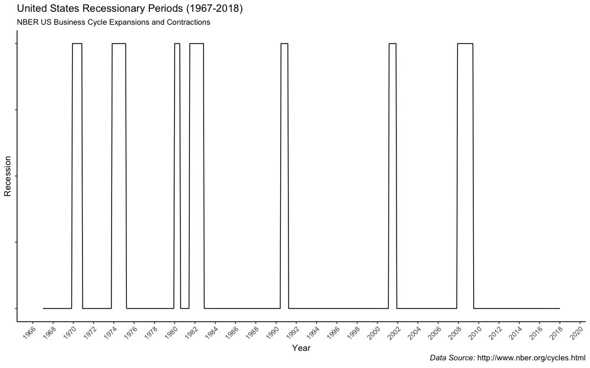
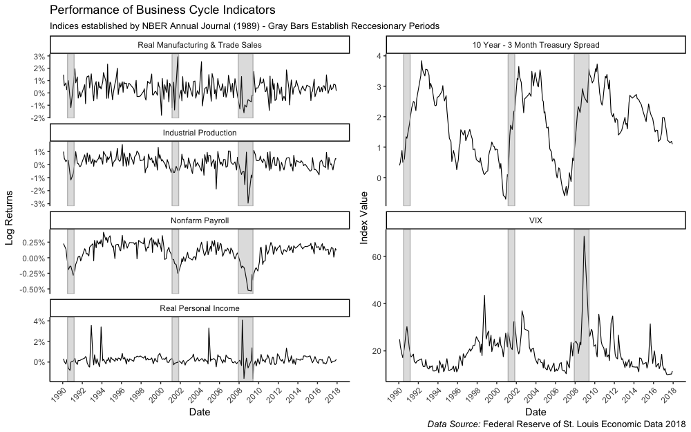
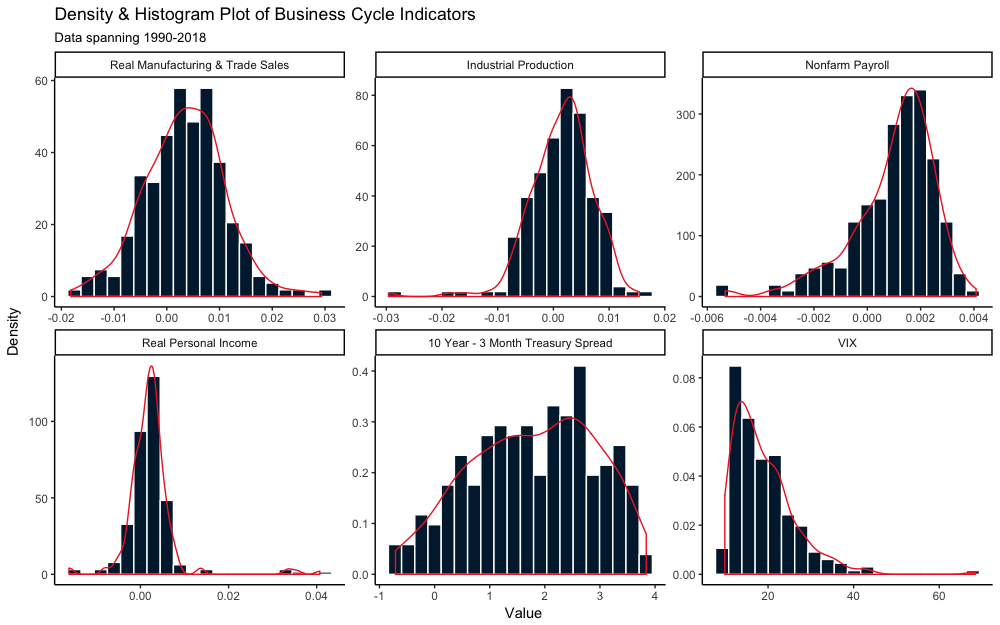
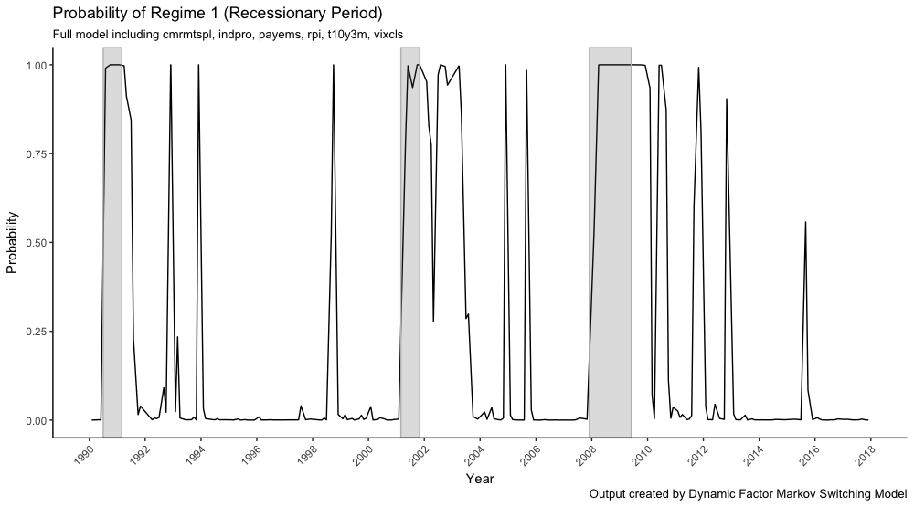
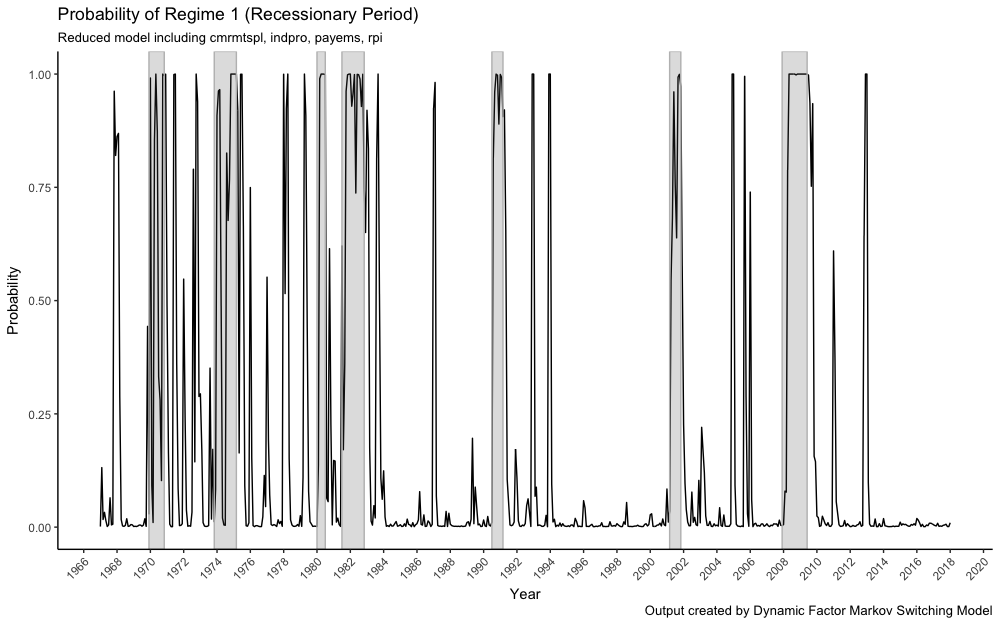
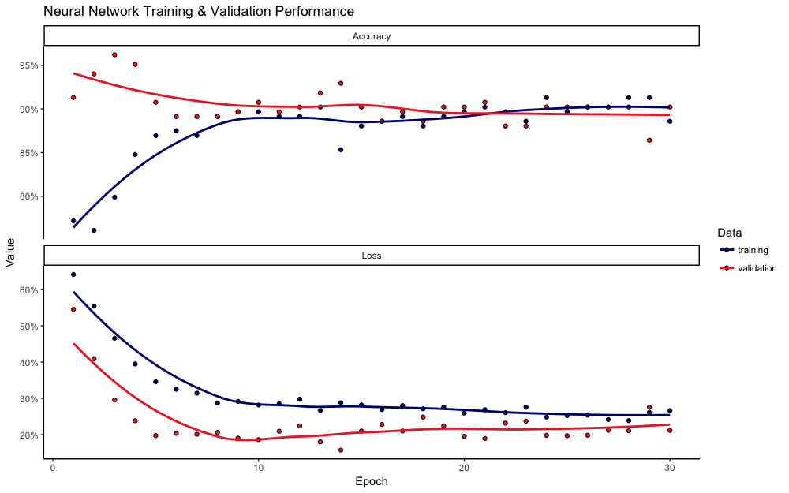

# "Dynamic Factor Markov Switching Model & Neural Networks"

## "Dylan McDowell"

## "April 7, 2018"

This is a repository holding all the information contained in my senior project where I analyze the performance of two models when predicting business cycle turning points. 

Here are some interesting plots I've made:

